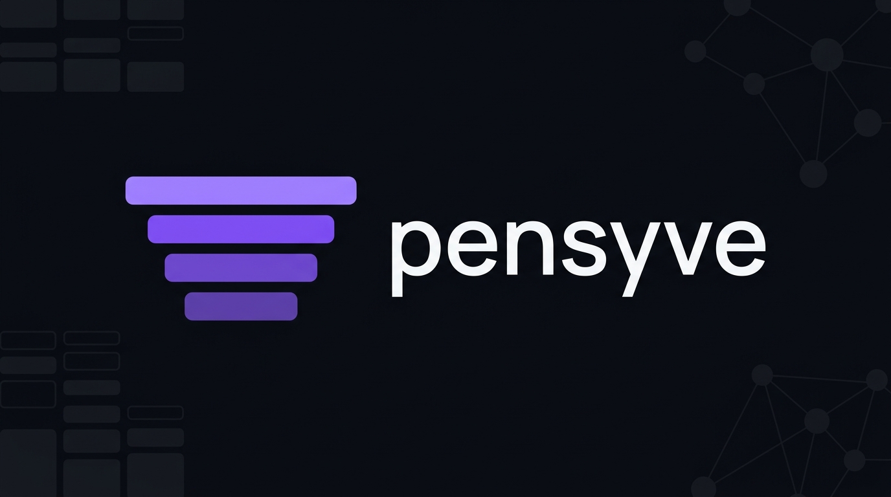
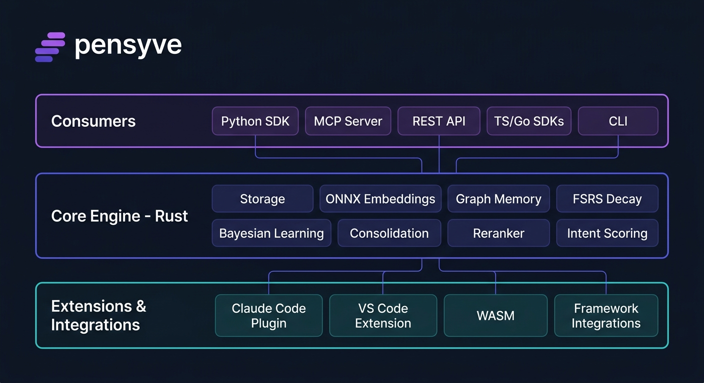

# Pensyve

Universal memory runtime for AI agents. Framework-agnostic, protocol-native, offline-first.

Agents use Pensyve to remember across sessions, learn from outcomes, and share knowledge — all backed by a Rust core engine with zero cloud dependencies required.

## Why Pensyve

Most AI agents lose all context between sessions. Pensyve gives them durable, intelligent memory:

- **Three memory types** — Episodic (what happened), Semantic (what is known), Procedural (what works)
- **Multimodal content** — Text, code, images, tool outputs, structured data
- **8-signal fusion retrieval** — Vector similarity, BM25 lexical, graph proximity, intent classification, recency, access frequency, confidence, type boost
- **Learns from outcomes** — Bayesian tracking on action→outcome procedures automatically surfaces what works
- **Forgetting curve** — FSRS-based memory decay with retrieval-induced reinforcement (memories you use get stronger)
- **Consolidation** — Background "dreaming" promotes repeated episodic facts to semantic knowledge
- **Offline-first** — SQLite storage, ONNX embeddings, optional local LLM extraction. No API keys needed.
- **Scales to cloud** — Feature-gated Postgres backend with pgvector for managed deployments
- **Cross-encoder reranking** — BGE reranker on top-k results for precision
- **Access control** — RBAC memory mesh with owner/writer/reader roles and private/shared/public visibility

## Quick Start

### Prerequisites

- Rust 1.88+
- Python 3.10+ with [uv](https://github.com/astral-sh/uv)
- [Bun](https://bun.sh) (optional, for TypeScript SDK)
- [Go 1.21+](https://go.dev) (optional, for Go SDK)

### Install

```bash
git clone https://github.com/major7apps/pensyve.git && cd pensyve

# Set up Python environment and install deps
uv sync --extra dev

# Build the Python SDK (compiles Rust → native Python module)
uv run maturin develop --release -m pensyve-python/Cargo.toml

# Verify
uv run python -c "import pensyve; print(pensyve.__version__)"
```

### 5-Line Demo

```python
import pensyve

p = pensyve.Pensyve()
with p.episode(p.entity("agent", kind="agent"), p.entity("user")) as ep:
    ep.message("user", "I prefer dark mode and use vim keybindings")
print(p.recall("what editor setup does the user prefer?"))
```

## Interfaces

Pensyve exposes its core engine through multiple interfaces — use whichever fits your stack.

### Python SDK

Direct in-process access via PyO3. Zero network overhead.

```python
import pensyve

p = pensyve.Pensyve(namespace="my-agent")
entity = p.entity("user", kind="user")

# Remember a fact
p.remember(entity=entity, fact="User prefers Python", confidence=0.95)

# Recall memories
results = p.recall("programming language", entity=entity)

# Record an episode
with p.episode(entity) as ep:
    ep.message("user", "Can you fix the login bug?")
    ep.message("agent", "Fixed — the session token was expiring early")
    ep.outcome("success")

# Consolidate (promote repeated facts, decay unused memories)
p.consolidate()
```

### MCP Server

Works with Claude Code, Cursor, and any MCP-compatible client.

```bash
cargo build --release --bin pensyve-mcp
```

```json
{
  "mcpServers": {
    "pensyve": {
      "command": "./target/release/pensyve-mcp",
      "env": { "PENSYVE_PATH": "~/.pensyve/default" }
    }
  }
}
```

**Tools exposed:** `recall`, `remember`, `episode_start`, `episode_end`, `forget`, `inspect`

### Claude Code Plugin

Full cognitive memory layer for Claude Code — install from the marketplace or manually.

```
pensyve-plugin/
├── 6 slash commands   /remember, /recall, /forget, /inspect, /consolidate, /memory-status
├── 4 skills           session-memory, memory-informed-refactor, context-loader, memory-review
├── 2 agents           memory-curator (background), context-researcher (on-demand)
└── 4 hooks            SessionStart, Stop, PreCompact, UserPromptSubmit
```

See [`integrations/claude-code/README.md`](integrations/claude-code/README.md) for details.

### REST API

FastAPI server with authentication, pagination, and metrics.

```bash
uvicorn pensyve_server.main:app --port 8000
```

```bash
# Remember
curl -X POST http://localhost:8000/v1/remember \
  -H "Content-Type: application/json" \
  -d '{"entity": "seth", "fact": "Seth prefers Python", "confidence": 0.95}'

# Recall
curl -X POST http://localhost:8000/v1/recall \
  -H "Content-Type: application/json" \
  -d '{"query": "programming language", "entity": "seth"}'
```

**Endpoints:** `POST /v1/entities`, `POST /v1/episodes/{start,message,end}`, `POST /v1/recall`, `POST /v1/remember`, `POST /v1/inspect`, `GET /v1/stats`, `DELETE /v1/entities/{name}`, `POST /v1/consolidate`, `GET /v1/health`, `GET /metrics`

### TypeScript SDK

HTTP client with timeout, retry, and structured errors.

```typescript
import { Pensyve } from "pensyve";

const p = new Pensyve({ baseUrl: "http://localhost:8000", timeoutMs: 10000, retries: 2 });
await p.remember({ entity: "seth", fact: "Likes TypeScript", confidence: 0.9 });
const memories = await p.recall("programming", { entity: "seth" });
```

### Go SDK

Context-aware HTTP client with structured errors.

```go
import pensyve "github.com/major7apps/pensyve-go"

client := pensyve.NewClient(pensyve.Config{BaseURL: "http://localhost:8000"})
ctx := context.Background()
client.Remember(ctx, "seth", "Likes Go", 0.9)
memories, _ := client.Recall(ctx, "programming", nil)
```

### CLI

```bash
cargo build --bin pensyve-cli

# Recall memories
./target/debug/pensyve-cli recall "editor preferences" --entity user

# Show stats
./target/debug/pensyve-cli stats

# Inspect an entity
./target/debug/pensyve-cli inspect --entity user
```

## Architecture



### Data Model

```
Namespace (isolation boundary)
  └── Entity (agent | user | team | tool)
        ├── Episodes (bounded interaction sequences)
        │     └── Messages (role + content)
        └── Memories
              ├── Episodic  — what happened (timestamped, multimodal content type)
              ├── Semantic  — what is known (SPO triples with temporal validity)
              └── Procedural — what works (action→outcome with Bayesian reliability)
```

### Retrieval Pipeline

1. **Embed** query via ONNX (Alibaba-NLP/gte-base-en-v1.5, 768 dims)
2. **Classify intent** — Question/Action/Recall/General (keyword heuristics)
3. **Vector search** — cosine similarity against stored embeddings
4. **BM25 search** — FTS5 lexical matching
5. **Graph traversal** — petgraph BFS from query entity
6. **Fusion scoring** — weighted sum of 8 signals (vector, BM25, graph, intent, recency, access, confidence, type boost)
7. **Cross-encoder reranking** — BGE reranker on top-20 candidates
8. **FSRS reinforcement** — retrieved memories get stability boost

## Project Structure

```
pensyve/
├── pensyve-core/       Rust engine (rlib) — storage, embedding, retrieval, graph, decay, mesh, observability
├── pensyve-python/     Python SDK via PyO3 (cdylib)
├── pensyve-mcp/        MCP server binary (stdio, rmcp)
├── pensyve-cli/        CLI binary (clap)
├── pensyve-ts/         TypeScript SDK (bun) — timeout, retry, PensyveError
├── pensyve-go/         Go SDK — context-aware HTTP client
├── pensyve-wasm/       WASM build — standalone minimal in-memory Pensyve
├── pensyve_server/     FastAPI REST API — auth, pagination, metrics, billing, Tier 2 extraction
├── integrations/       All integrations — IDE plugins, framework adapters, code harnesses
│   ├── claude-code/    Claude Code plugin (commands, skills, agents, hooks)
│   ├── vscode/         VS Code sidebar extension
│   ├── openclaw-plugin/ OpenClaw native memory plugin (TypeScript)
│   ├── opencode-plugin/ OpenCode native memory plugin (TypeScript)
│   ├── cursor/         Cursor MCP setup guide
│   ├── cline/          Cline MCP setup guide
│   ├── windsurf/       Windsurf MCP setup guide
│   ├── continue/       Continue MCP setup guide
│   ├── vscode-copilot/ VS Code Copilot Chat MCP setup guide
│   ├── langchain/      LangChain/LangGraph Python (PensyveStore + legacy PensyveMemory)
│   ├── langchain-ts/   LangChain.js/LangGraph.js TypeScript (PensyveStore)
│   ├── crewai/         CrewAI (PensyveStorage + standalone PensyveCrewMemory)
│   └── autogen/        Microsoft AutoGen multi-agent memory
├── tests/python/       Python integration tests
├── benchmarks/         LongMemEval_S evaluation + weight tuning
├── website/            Astro + Tailwind static site for pensyve.com
└── docs/               Architecture, roadmap, design specs, implementation plans
```

## Development

### First-Time Setup

```bash
# Install dependencies (creates .venv automatically)
uv sync --extra dev

# Build the native Python module (required before running any Python code)
uv run maturin develop --release -m pensyve-python/Cargo.toml

# Verify the module loads
uv run python -c "import pensyve; print(pensyve.__version__)"
```

> **Note:** The `pensyve` Python package is a native Rust extension built with PyO3.
> You must run `uv run maturin develop` before `pytest` or any Python import of `pensyve`,
> otherwise you will get `ModuleNotFoundError: No module named 'pensyve'`.

### Build & Test

```bash
make build      # Compile Rust + build PyO3 module
make test       # Run all tests (Rust + Python)
make lint       # clippy + ruff + pyright
make format     # cargo fmt + ruff format
make check      # lint + test (CI gate)
```

To run test suites individually:

```bash
cargo test --workspace                                       # Rust tests
uv run maturin develop --release -m pensyve-python/Cargo.toml  # Build PyO3 module first
uv run pytest tests/python/ -v                               # Python tests
cd pensyve-ts && bun test                                    # TypeScript tests
cd pensyve-go && go test ./...                               # Go tests
```

### Additional SDKs

```bash
cd pensyve-ts && bun test          # TypeScript (38 tests)
cd pensyve-go && go test ./...     # Go (17 tests)
cd pensyve-wasm && cargo check     # WASM (standalone)
```

### Benchmarks

```bash
# Run LongMemEval_S evaluation (builtin dataset: 87.5% baseline)
python benchmarks/longmemeval/run.py --verbose

# Run weight optimization
python benchmarks/tuning/optimize.py --maxiter 50
```

## Competitive Landscape

| Feature | Pensyve | Mem0 | Zep | Honcho |
|---------|---------|------|-----|--------|
| Offline-first (no cloud required) | **Yes** | No | No | No |
| Procedural memory (learns from outcomes) | **Yes** | No | No | No |
| Multi-signal fusion scoring | **8 signals** | 1 | 3 | 1 |
| Retrieval-induced reinforcement (FSRS) | **Yes** | No | No | No |
| Intent-aware retrieval | **Yes** | No | No | No |
| Multimodal content types | **Yes** | Text only | Text only | Text only |
| RBAC memory mesh | **Yes** | No | No | No |
| Cross-platform local LLM extraction | **Yes** | No | Cloud only | Cloud only |
| MCP server | **Yes** | No | No | Plugin |
| Claude Code plugin | **Yes** | No | No | No |
| VS Code extension | **Yes** | No | No | No |
| Framework integrations | **5** | 3 | 1 | 1 |
| Postgres backend | **Yes** (feature-gated) | Yes | Yes | Yes |
| Go SDK | **Yes** | No | No | No |
| WASM build | **Yes** | No | No | No |
| Open source engine | Apache 2.0 | Yes | Partial | Yes |

## License

[Apache 2.0](LICENSE)
