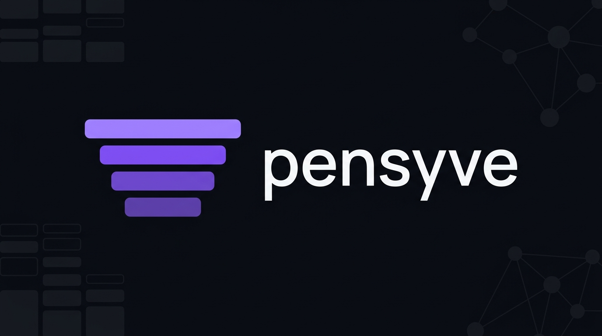

# Pensyve

[](https://github.com/major7apps/pensyve/actions/workflows/ci.yml)
[](LICENSE)
[](https://www.python.org/downloads/)
[](https://www.rust-lang.org/)

Pensyve is an open-source runtime for persistent AI agent memory. It stores facts,
conversations, observations, and action outcomes so an agent can retrieve them
in later sessions. You can use it through Python, a Model Context Protocol
(MCP) server, a command-line tool, or a REST API.

The Rust engine uses SQLite for local storage and runs embedding models
locally to search by meaning. TypeScript and Go clients connect to a gateway
you run yourself. Local use does not require a Pensyve account or API key.
Your application or client integration calls Pensyve to save and retrieve
memories.

## Choose a setup

| Use case | Start here |
| --- | --- |
| Add persistent memory to a Python agent | [Python quick start](#python-quick-start) |
| Give Claude Code, Cursor, or Codex access to memory tools | [MCP server](#mcp-server) and [client setup guides](#sdks-and-integrations) |
| Share a memory store through TypeScript, Go, or REST | [HTTP gateway](#http-gateway) |
| Use a LangChain or LangGraph adapter | [Python integration](integrations/langchain/README.md) or [TypeScript integration](integrations/langchain-ts/README.md) |

## Project status

Pensyve Cloud closed on October 1, 2026. The open-source project continues in
this repository under the Apache 2.0 license, with the engine, SDKs,
integrations, and documentation available here.

Pensyve is in maintenance mode. Releases cover security fixes and dependency
updates, with no new features planned. See the [maintenance policy](MAINTENANCE.md)
for contribution and support expectations. If you have a saved Cloud export,
the [self-hosting guide](docs/self-host.md#dropping-in-an-exported-store)
explains how to use it with your own gateway.

## What you can do

- Store facts about users, projects, or other named entities, and record conversations as episodes.
- Search memories using text matching, embeddings, and relationships between entities.
- Record observations and action outcomes, and use consolidation to promote repeated facts and update memory retention.
- Keep data in local SQLite storage, or run the HTTP gateway with SQLite or PostgreSQL.

Embedding models may download when first loaded unless they are already
cached. Running without network access requires preparing the model files
first. See the [model setup and deployment guide](docs/self-host.md).

## How agent memory works

Pensyve stores memory outside the language model. Your application saves
facts or conversations, searches for relevant records, and adds the results
to a later prompt. Reusing the same storage path and namespace lets the
agent retrieve information across processes and sessions. Saving a memory
does not train the language model or change its weights.

The store holds four kinds of records: facts (semantic memory), conversations
(episodic memory), action outcomes (procedural memory), and observations.
Your integration decides what to record and when to retrieve it. Recording
a conversation does not automatically turn it into a successful procedure.
See [how storage and retrieval work](docs/ARCHITECTURE.md#data-model) and
the [usage recipes](docs/RECIPES.md) for the APIs and their limits.

## Python quick start

Python 3.10 or newer is required.

```bash
pip install pensyve
```

Create a local store, save a fact, and retrieve it:

```python
import pensyve

p = pensyve.Pensyve(path="./memories", namespace="my-agent")
user = p.entity("user", kind="user")

p.remember(
    entity=user,
    fact="Prefers dark mode and vim keybindings",
    confidence=0.95,
)

for memory in p.recall("editor preferences", entity=user):
    print(memory.content)
```

Reuse the same path and namespace in a later process to retrieve saved
memories. The Python SDK runs the engine in your process and does not need
the HTTP gateway.

You can also record a conversation with the same `p` and `user`:

```python
with p.episode(user) as episode:
    episode.message("user", "Use dark mode in my editor")
    episode.message("agent", "I updated the editor settings")
    episode.outcome("success")

groups = p.recall_grouped("editor settings", limit=10)
for group in groups:
    for memory in group.memories:
        print(memory.content)
```

`recall_grouped()` groups results by source session for use in an agent's
prompt. See the [Python SDK guide](pensyve-python/README.md) and
[recipes](docs/RECIPES.md) for more examples.

## MCP server

Pensyve's local MCP memory server lets clients such as Claude Code, Codex,
and Cursor store and retrieve memories across sessions. From a checkout of
this repository, install the server with Rust 1.94 or newer:

```bash
git clone https://github.com/major7apps/pensyve.git
cd pensyve
cargo install --path pensyve-mcp --locked
```

Make sure Cargo's binary directory is on your client's `PATH`, then add a
stdio server entry to its MCP configuration:

```json
{
  "mcpServers": {
    "pensyve": {
      "command": "pensyve-mcp",
      "args": ["--stdio"],
      "env": {
        "PENSYVE_NAMESPACE": "my-project"
      }
    }
  }
}
```

The server provides tools such as `pensyve_remember`, `pensyve_recall`,
`pensyve_observe`, and `pensyve_inspect`. It stores data locally and needs no
API key. The configuration file location depends on your client. See the
[MCP setup guide](docs/GETTING_STARTED.md#mcp-server) and
[integration guides](integrations/README.md).

## HTTP gateway

Run the gateway to access Pensyve over REST or MCP HTTP, including from the
TypeScript and Go SDKs. From the repository root, start a local instance:

```bash
HOST=127.0.0.1 PENSYVE_API_KEYS=psy_local_example \
  cargo run --release -p pensyve-mcp-gateway
```

In another terminal, save and recall a fact:

```bash
curl http://localhost:3000/v1/remember \
  -H "Authorization: Bearer psy_local_example" \
  -H "Content-Type: application/json" \
  -d '{"entity":"user","fact":"Prefers Python","confidence":0.95}'

curl http://localhost:3000/v1/recall \
  -H "Authorization: Bearer psy_local_example" \
  -H "Content-Type: application/json" \
  -d '{"query":"programming language","entity":"user"}'
```

The MCP HTTP endpoint is `http://localhost:3000/mcp`. Use the same API key in
your client's `Authorization: Bearer` header.

The example key is for local testing. For a deployment, choose your own key
with the required `psy_` prefix and configure HTTPS and allowed hosts. See
the [self-hosting guide](docs/self-host.md),
[gateway configuration](pensyve-mcp-gateway/README.md), and
[security documentation](docs/SECURITY.md).

## SDKs and integrations

The TypeScript and Go SDKs require a running gateway. Configure its URL and,
when authentication is enabled, an API key from that gateway.

| Interface | Installation or guide |
| --- | --- |
| Python | `pip install pensyve`, [SDK guide](pensyve-python/README.md) |
| TypeScript | `npm install @pensyve/sdk`, [SDK guide](pensyve-ts/README.md) |
| Go | `go get github.com/major7apps/pensyve/pensyve-go/v5@latest`, [SDK guide](pensyve-go/README.md) |
| Claude Code | [Plugin setup](integrations/claude-code/README.md) |
| Cursor | [MCP setup and rules](integrations/cursor/README.md) |
| Codex | [Plugin setup](integrations/codex-plugin/README.md) |
| LangChain and LangGraph | [Python adapter](integrations/langchain/README.md), [TypeScript adapter](integrations/langchain-ts/README.md) |
| Other clients and frameworks | [Integration index](integrations/README.md) |

## Command-line tool

From the repository root, install the CLI and inspect its commands:

```bash
cargo install --path pensyve-cli --locked
pensyve --help
pensyve status
pensyve recall "editor preferences" --entity user
```

The binary is named `pensyve`. Its default output is JSON, and `--format text`
selects text output. The CLI uses its own default local storage location;
it does not automatically open the `./memories` directory from the Python
example. See the [CLI source and command definitions](pensyve-cli/src/main.rs)
for storage and namespace options.

## Documentation

| Guide | Contents |
| --- | --- |
| [Documentation index](docs/README.md) | Choose a setup, find API guides, and identify historical plans |
| [Getting started](docs/GETTING_STARTED.md) | Setup by client or SDK |
| [Self-hosting](docs/self-host.md) | Gateway deployment, model files, backups, and saved Cloud exports |
| [Recipes](docs/RECIPES.md) | Recall, facts, episodes, observations, and other API examples |
| [Architecture](docs/ARCHITECTURE.md) | Storage, retrieval, and component boundaries |
| [Security](docs/SECURITY.md) | Authentication, namespace isolation, and execution limits |
| [Reliability](docs/RELIABILITY.md) | Tests and runtime guarantees |
| [Changelog](CHANGELOG.md) | Release history and breaking changes |

## Development and contributions

Start with [CONTRIBUTING.md](CONTRIBUTING.md) for prerequisites and setup.
From the repository root:

```bash
uv sync --extra dev
make build
make check
```

`make build` compiles Rust and builds the Python extension. `make check`
runs the Rust and Python lint and test commands. TypeScript and Go have
separate checks documented in the contribution guide.

Issues and pull requests follow the [maintenance policy](MAINTENANCE.md).
Report security issues through [private vulnerability reporting](SECURITY.md).

## License

Pensyve is licensed under [Apache 2.0](LICENSE).
